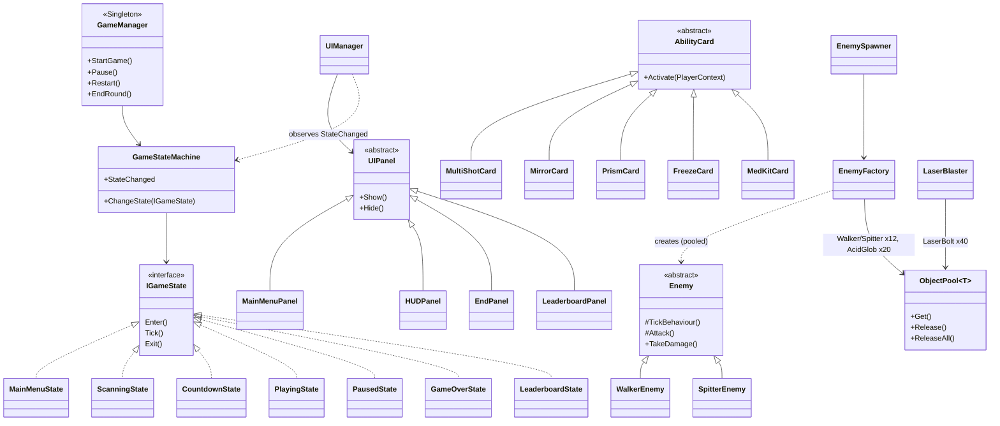

# RICOCHET: Technical Document (draft for the 1–3 page PDF)

**Author:** Eseosa Kay-Uwagboe Pascal · **Engine:** Unity 6000.4.5f1, AR Foundation 6.4, ARCore, URP · **Platform:** Android (ARM64, IL2CPP)

## 1. Overview
RICOCHET is a timed first-person AR survival shooter.

1. The player scans their floor and taps to place a beacon. It is anchored to the detected plane, and only one can ever be placed.
2. Zombies rise from the floor and walk toward the player.
3. The player's laser bolts reflect off real walls (AR vertical planes) and placeable mirrors. Each bounce raises the score multiplier.
4. The round ends with SURVIVED (the timer reaches 0) or OVERRUN (health reaches 0).
5. Each run is saved to a local leaderboard that keeps the latest 5 sessions.

## 2. Architecture

Flow: **MainMenu → Scanning** (first time only) **→ Countdown → Playing ⇄ Paused → GameOver → MainMenu / Countdown**.

## 3. OOP

| Principle | How it is used |
|---|---|
| **Encapsulation** | Tuning values are `private [SerializeField]` fields exposed through read-only properties. State changes only happen through methods (`TakeDamage`, `Heal`, `AddPoints`). |
| **Abstraction** | `Enemy`, `AbilityCard`, `UIPanel`, `PlacedGadget` (abstract classes); `IGameState`, `IPoolable`, `IDamageable` (interfaces). |
| **Inheritance** | `WalkerEnemy`/`SpitterEnemy : Enemy`; the 5 cards `: AbilityCard`; 7 panels `: UIPanel`; `Mirror`/`Prism : PlacedGadget`. |
| **Polymorphism** | `Enemy.TickBehaviour()`/`Attack()` overrides (melee vs ranged); `AbilityCard.Activate()`; `IDamageable.TakeDamage()` is called the same way on the player and on enemies; the 7 state implementations. |

## 4. Design patterns

| Pattern | Implementation | Why |
|---|---|---|
| **Object Pool** | `ObjectPool<T>` (see section 5) | No GC spikes or Instantiate cost during play. Required for projectiles. |
| **Singleton** | `GameManager`, `AudioManager`, `VfxManager` (duplicates destroy themselves) | One global entry point for game commands, sound and effects. |
| **State** | `GameStateMachine` + `IGameState` | Each phase switches its systems on in Enter and off in Exit, so there are no `if (state == …)` chains. |
| **Factory** | `EnemyFactory.Create(EnemyType, pos)` | The spawner doesn't know about prefabs or pools. Adding an enemy type only touches the factory. |
| **Observer** | C# events: `PlayerHealth.HealthChanged/Died`, `ScoreSystem.ScoreChanged/PointsAwarded`, `RoundTimer.TimeChanged`, `GameEvents.EnemyKilled`, `GameStateMachine.StateChanged`, `ARPlacementController.ArenaPlaced` | The UI only listens, so gameplay never references UI. |
| **Data-driven config** | ScriptableObjects: `DifficultySettings` x3, `EnemyStats` x2, `WeaponStats`, `SoundLibrary` | Changing the difficulty means swapping one asset. |

## 5. Object Pool implementation
- `ObjectPool<T> where T : Component, IPoolable` creates all instances in its constructor (pre-warm, during `Awake`) under a world-space "Pools" object.
- **Get(pos, rot):**
  1. Pops an inactive instance.
  2. Positions and activates it.
  3. Adds it to the active list.
  4. Calls `OnSpawned()`.
- **Release(item):** calls `OnDespawned()`, deactivates the item and pushes it back. Double releases are ignored.
- **ReleaseAll()** wipes the board at game end.
- If a pool is empty it grows by one and logs a warning. `PoolRegistry` shows `active/total, grown` on the pause screen as proof that nothing is instantiated during play.
- Reset on reuse (`OnSpawned`):
  - **LaserBolt:** bounce count 0, hit mask restored, can-split flag, lifetime, `TrailRenderer.Clear()`.
  - **Enemy:** health, rise animation, cooldown, slow effect, knockback, collider, hit flash.
  - **AcidGlob:** lifetime, trail.
- Pools and sizes:

| Pool | Size |
|---|---|
| Laser bolts | 40 |
| Acid globs | 20 |
| Walkers | 12 |
| Spitters | 12 |
| Cards | 2 per type |
| Mirrors / Prisms | 4 each |
| Floating score texts | 12 |
| 3D audio sources | 10 (round-robin) |

## 6. Laser ricochet
1. Each frame a bolt does `Physics.SphereCast(position, r, direction, out hit, speed*dt, mask)`. This is continuous collision, so there is no tunnelling and no Rigidbody.
2. On a hit with ReflectiveWall or Mirror: `direction = Vector3.Reflect(direction, hit.normal)`, then the bounce count goes up by one (max 3), and the bolt continues with the remaining distance in the same frame.
3. On a hit with an Enemy: 1 damage, with score multiplier ×1 / ×1.5 / ×2 / ×3 by bounce count.

## 7. Sound system
- `AudioManager` owns all AudioSources:
  - 1 music source
  - 1 2D one-shot source
  - 10 pooled 3D sources
- Enemies and bullets have no AudioSource, which prevents duplicated components.
- Gameplay calls `AudioManager.Instance.Play(SoundId)` / `PlayAt(SoundId, position)`. The `SoundLibrary` ScriptableObject maps each id to clips, volume, pitch variation and a 2D/3D flag.

| Required sound | Trigger |
|---|---|
| Player shoot | `LaserBlaster.Fire` |
| Player death | `PlayerHealth.Died` → `DamageFeedback` |
| Enemy spawn | `EnemyFactory.Create` (3D) |
| Enemy shoot | `SpitterEnemy.Attack` (3D) |
| Enemy damage (melee hits player) | `WalkerEnemy.LandHit` |

**Sources:** all clips were procedurally synthesized by `Scripts/Editor/SfxSynth.cs` (oscillators, noise and envelopes), written for this project. They are original work with no third-party licence. *(If any clips are later replaced with Kenney CC0 packs, list them here with links.)*

## 8. AR specifics
- **Custom plane tracker:** `ARPlaneStyler`. Floors show a texture with the author's full name (tiled every 50 cm) on layer ARFloor. Walls show a neon grid on layer ReflectiveWall, and their MeshCollider reflects lasers.
- **Placement:** single placement through `ARAnchorManager.AttachAnchor`. After placement, detection switches to vertical only (new floors stop appearing) and the floors are dimmed.
- **No walls detected?** Mirror cards make the game fully playable anyway, and the HUD shows "WALLS: N".
