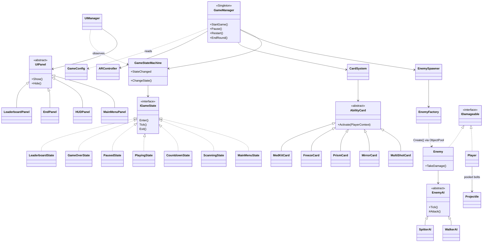

# RICOCHET: Technical Document (draft for the 1–3 page PDF)

**Author:** Eseosa Kay-Uwagboe Pascal · **Engine:** Unity 6000.4.5f1, AR Foundation 6.4, ARCore, URP · **Platform:** Android (ARM64, IL2CPP)

## 1. Overview
RICOCHET is a timed first-person **augmented reality** survival shooter played in the player's real room.

1. The phone scans the floor. The detected floor is shown with a custom texture carrying the author's name.
2. The player taps to place a beacon, which is anchored to the real floor. Only one can ever be placed.
3. Zombies rise out of the real floor and walk toward the player.
4. Laser bolts reflect off real walls (AR vertical planes) and placeable mirrors. Each bounce raises the score multiplier.
5. The round ends with SURVIVED (the timer reaches 0) or OVERRUN (health reaches 0).
6. Each run is saved to a local leaderboard that keeps the latest 5 sessions.

The project uses **10 scripts**. Each component or ScriptableObject has its own file, as Unity requires. Supporting logic is written as plain C# classes inside the related file.

## 2. Architecture

Flow: **MainMenu → Scanning** (first time only) **→ Countdown → Playing ⇄ Paused → GameOver → MainMenu / Countdown**.

## 3. OOP
- **Encapsulation:** private serialized fields exposed through read-only properties. State changes only through methods.
- **Abstraction:**
  - abstract classes: `EnemyAI`, `AbilityCard`, `UIPanel`, `GameStateBase`
  - interfaces: `IGameState`, `IPoolable`, `IDamageable`
- **Inheritance:**
  - `WalkerAI`/`SpitterAI : EnemyAI`
  - 5 cards `: AbilityCard`
  - 7 panels `: UIPanel`
  - 7 states `: GameStateBase`
- **Polymorphism:**
  - `Enemy` calls `EnemyAI.Tick()`: melee vs ranged behaviour.
  - `CardSystem` calls `AbilityCard.Activate()`.
  - `IDamageable.TakeDamage()` works the same on the player and on enemies.
  - The state machine calls `Enter/Tick/Exit` on any state.

## 4. Design patterns
| Pattern | Implementation | Why |
|---|---|---|
| Object Pool | `ObjectPool<T>` | No allocations or Instantiate during play (required for projectiles) |
| Singleton | `GameManager`, `AudioManager` | One global access point; duplicates destroy themselves |
| State | `GameStateMachine` + 7 states | Each phase switches its systems on and off cleanly |
| Factory | `EnemyFactory.Create(type, pos)`, `EnemyAI.Create(type)` | Callers don't know about prefabs or pools |
| Observer | C# events (health, score, timer, heat, state, arena placed, enemy killed) | UI listens; gameplay never references UI |
| Data-driven | `GameConfig` ScriptableObject | Difficulty and balance without code changes |

## 5. Object Pool implementation
- `ObjectPool<T> where T : Component` creates every instance in its constructor (pre-warm, during `Awake`) under a world-space "Pools" object.
- **Get(position, rotation):**
  1. Pops an inactive instance.
  2. Positions and activates it.
  3. Adds it to the active list.
  4. Calls `IPoolable.OnSpawned()`.
- **Release(item):** calls `OnDespawned()`, deactivates the item and pushes it back. Double releases are ignored.
- **ReleaseAll()** wipes the board at game end.
- An empty pool grows by one and logs a warning. `PoolRegistry` shows `active/total, grown` on the pause screen.
- Reset on reuse:
  - **Projectile:** bounce count, hit mask, split flag, lifetime, `TrailRenderer.Clear()`.
  - **Enemy:** health, rise animation, cooldown, slow effect, knockback, collider, hit flash, AI state.
- Pool sizes:

| Pool | Size |
|---|---|
| Laser bolts | 40 |
| Acid globs | 20 |
| Walkers | 12 |
| Spitters | 12 |
| Cards | 2 per type |
| Mirrors / Prisms | 4 each |
| Floating texts | 12 |

## 6. Laser ricochet
1. Each frame a bolt does `Physics.SphereCast(pos, r, dir, out hit, speed*dt, mask)`.
2. On a wall or mirror it reflects with `dir = Vector3.Reflect(dir, hit.normal)` and the bounce count goes up by one (max 3). It continues moving within the same frame.
3. On an enemy it deals 1 damage with a score multiplier of ×1 / ×1.5 / ×2 / ×3 depending on bounces.

## 7. Sound system
- `AudioManager` owns all audio sources:
  - 1 music source
  - 1 2D one-shot source
  - 10 pooled 3D sources
- No AudioSource on enemies or projectiles, so components are never duplicated.
- Gameplay calls `Play(SoundId)` / `PlayAt(SoundId, position)`. `GameConfig` maps each id to clips, volume, pitch range and a 2D/3D flag.

| Required sound | Trigger |
|---|---|
| Player shoot | `Player.Fire` |
| Player death | `Player.TakeDamage` → health reaches 0 |
| Enemy spawn | `EnemyFactory.Create` (3D) |
| Enemy shoot | `SpitterAI.Attack` (3D) |
| Enemy damage (melee) | `WalkerAI.LandHit` |

**Sources:** all clips were procedurally synthesized for this project. They are original work with no third-party licence.
