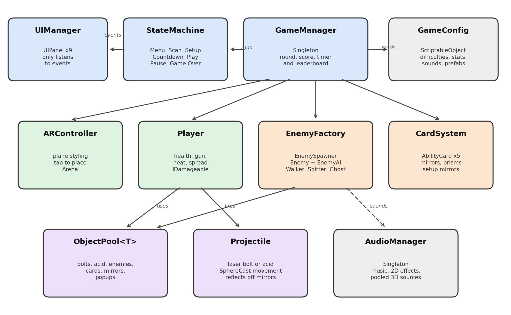

# RICOCHET: Technical Document

**Eseosa Kay-Uwagboe Pascal**
Unity 6 (6000.4.5f1), AR Foundation 6.4, ARCore, Universal Render Pipeline, Android

## Overview

RICOCHET is a first person survival shooter that runs in augmented reality on Android. The phone camera shows the player's real room; ARCore finds the floor and the walls, and the game is anchored to that floor. Zombies grow out of the floor and walk towards the player, who fights back with a laser gun whose shots bounce off real walls and off mirrors that the player places before the round starts. The round is timed; surviving until the clock reaches zero is a win, and losing all health ends the run. Every run is saved to a local leaderboard that keeps the latest five sessions. The whole game lives in one scene, and the menus are simply panels on a single canvas.

## Architecture

The code is split into ten scripts inside the Ricochet namespace. GameManager sits in the middle; it owns the state machine, the score, the round timer and the leaderboard, and it creates the plain C# helpers that do not need to be components, such as the EnemyFactory, the EnemySpawner and the CardSystem. Every number that affects balance lives in one ScriptableObject called GameConfig; I can change a difficulty, an enemy or a sound there without touching any code. ARController handles everything to do with AR; it styles the planes that ARCore finds, places the beacon when the player taps, and passes later taps on to the mirror setup. Player sits on the AR camera because in this game the phone is the player. UIManager is never called by gameplay code; it only listens.

## OOP structure

I used encapsulation throughout. Tuning values are private serialized fields; other classes can only read them through properties, and they can only change state through methods such as TakeDamage, Heal and Add.

Abstraction comes from four abstract classes and three interfaces. EnemyAI, AbilityCard, UIPanel and GameState describe what every enemy behaviour, card, screen and game state must do; IGameState, IPoolable and IDamageable are small contracts that very different objects can share.

Inheritance gives each family its members. WalkerAI and SpitterAI extend EnemyAI, and GhostAI extends WalkerAI; five cards extend AbilityCard; nine panels extend UIPanel; nine states extend GameState.

Polymorphism is where this pays off. The Enemy component only ever calls Tick and CanBeHurtBy on its AI; whether that means walking up and clawing, stopping three metres away to spit acid, or ignoring any laser that has not touched a mirror depends on which subclass it holds. In the same way a projectile calls TakeDamage on whatever it hits through IDamageable, so the same laser code works on every enemy and the same acid code works on the player.

## Design patterns and why

The Object Pool is the most important pattern in the project, so it has its own section below.

GameManager and AudioManager are Singletons. There must only ever be one of each, and many systems need to reach them; a static Instance is simpler than passing references everywhere. Each one destroys any duplicate in Awake.

The State pattern drives the game flow. MenuState, ScanState, SetupState, CountdownState, PlayState, PauseState and GameOverState, plus the instructions and leaderboard states, each switch on the systems they need in Enter and switch them off again in Exit. This keeps the flow easy to follow and avoids long chains of if statements.

The Factory pattern is used in EnemyFactory.Create. The spawner only asks for a type and a position; it never needs to know which prefab or pool is behind it. EnemyAI.Create is a smaller factory that picks the right behaviour class for each enemy type.

The Observer pattern is built on C# events. The player raises HealthChanged and Died; the score raises Changed and Gained; the timer raises Changed; enemies announce their deaths through GameEvents. The UI subscribes to these events, so gameplay code never references the UI at all.

## Object pool implementation

ObjectPool is a generic class that works with any component. When it is created it instantiates the full number of objects up front, switches them off and keeps them on a stack. Get takes one from the stack, moves it into place, switches it on and calls OnSpawned if the object implements IPoolable; Return does the opposite and puts it back. ReturnAll clears the board at the end of a round. If a pool ever runs out it grows by one and logs a warning; the pause screen lists every pool with its active count, its total and how many times it grew, which is how I confirmed that nothing is instantiated during play.

Laser bolts use a pool of forty, acid globs use twenty, Walkers and Spitters use twelve each and Ghosts use six; cards, mirrors, prisms and the floating score text are pooled as well.

Reuse only works if old state is cleared, so OnSpawned resets everything. A projectile resets its bounce count, its mirror flag, its hit mask and its lifetime, and it clears its trail so it does not draw a line from where it last died. An enemy resets its health, cooldown, slow effect, knockback, colour and AI state.

Projectiles have no Rigidbody. Each frame a bolt casts a small sphere from where it is to where it will be; this means it can never skip through a thin AR wall. When the sphere hits a wall or a mirror the direction is reflected with Vector3.Reflect, the bounce count goes up and the bolt changes colour. When it hits an enemy it deals one point of damage and carries a score multiplier of 1, 1.5, 2 or 3 depending on how many times it bounced.

## Sound system structure

All sound goes through AudioManager. It creates one looping source for music, one source for flat effects such as the gun and the interface, and a pool of ten positional sources that are moved to wherever a sound happens, such as an enemy rising or a Spitter spitting. Gameplay code only asks for a SoundId; GameConfig maps each id to its clips, its volume, its pitch range and whether it should be positional. Enemies and projectiles have no AudioSource of their own, so there are no duplicated components, and a small random change in pitch stops repeated sounds from feeling robotic.

The five required sounds are shoot for the player firing, death for the player dying, rise for an enemy spawning, spit for the Spitter firing and claw for a Walker hitting the player. The extra sounds are bounce, hit, groan, hurt, pickup, mirror, overheat, beep, go, win, click and a music loop.

## Sources

Every sound in the project was made for this project; I generated them in code from simple waveforms, noise and volume envelopes and saved them as WAV files, so no outside audio and no licence is involved. The textures, including the floor texture that shows my name, were also drawn in code. The zombies, the gun, the beacon, the mirrors and the cards are built from Unity primitives. The packages used are Unity AR Foundation, the Google ARCore XR Plugin, the Universal Render Pipeline, the Input System and TextMeshPro.
